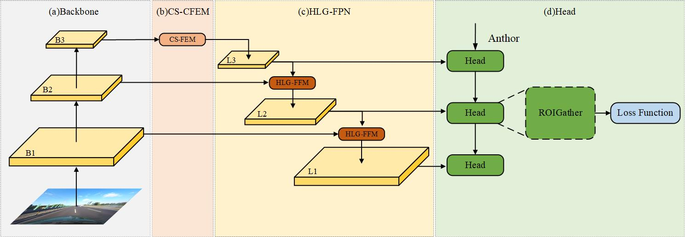
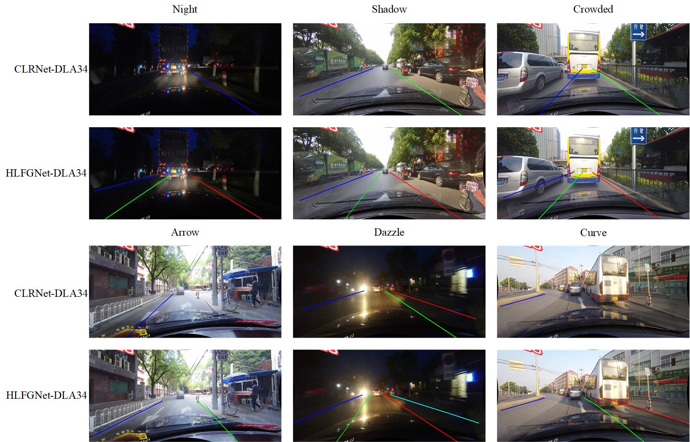

<div align="center">

# HiFi-CaNet: A High-Level Feature Guided Cascade Network for Lane Detection

</div>


Pytorch implementation of the paper "HiFi-CaNet: A High-Level Feature Guided Cascade Network for Lane Detection".

This code is improved by [CLRNet](https://github.com/Turoad/clrnet) source code.

## Introduction

- A Channel-Space Cooperative Feature Enhancement Module (CS-CFEM) is proposed.
- A High-Level Guided Feature Pyramid Network (HLG-FPN) is proposed.
- Distance Lane IoU(DLIoU) loss is proposed.
- The effect of HiFi-CaNet on CULane dataset is better than that of the benchmark model CLRNet.

## Installation

### Prerequisites
Only test on Ubuntu18.04 and 20.04 with:
- Python >= 3.8 (tested with Python3.8)
- PyTorch >= 1.6 (tested with Pytorch1.6)
- CUDA (tested with cuda10.2)
- Other dependencies described in `requirements.txt`

### Data preparation

#### CULane

Download [CULane](https://xingangpan.github.io/projects/CULane.html). Then extract them to `$CULANEROOT`. Create link to `data` directory.

```Shell
cd $CLRNET_ROOT
mkdir -p data
ln -s $CULANEROOT data/CULane
```

For CULane, you should have structure like this:
```
$CULANEROOT/driver_xx_xxframe    # data folders x6
$CULANEROOT/laneseg_label_w16    # lane segmentation labels
$CULANEROOT/list                 # data lists
```


## Getting Started

### Training
For training, run
```Shell
python main.py [configs/path_to_your_config] --gpus [gpu_num]
```

For example, run
```Shell
python main.py configs/hificanet/hf_resnet101_culane.py --gpus 0
```

### Validation
For testing, run
```Shell
python main.py [configs/path_to_your_config] --[test|validate] --load_from [path_to_your_model] --gpus [gpu_num]
```

For example, run
```Shell
python main.py configs/hificanet/hf_dla34_culane.py --validate --load_from culane_dla34.pth --gpus 0
```

Currently, this code can output the visualization result when testing, just add `--view`.
We will get the visualization result in `work_dirs/xxx/xxx/visualization`.


## Results


[assets]: https://github.com/turoad/CLRNet/releases

### CULane

| Methods          |   Backbone  | F1@50 |
|:-----------------| :---  |:-----:|
 CLRNet           | [ResNet-101][assets] | 79.90 |
 CLRNet           | [DLA-34][assets]     | 80.20 | 
 HiFi-CaNet(Ours) | [ResNet-101][assets] | 79.92 |
 HiFi-CaNet(Ours) | [DLA-34][assets]     | 80.39 | 


